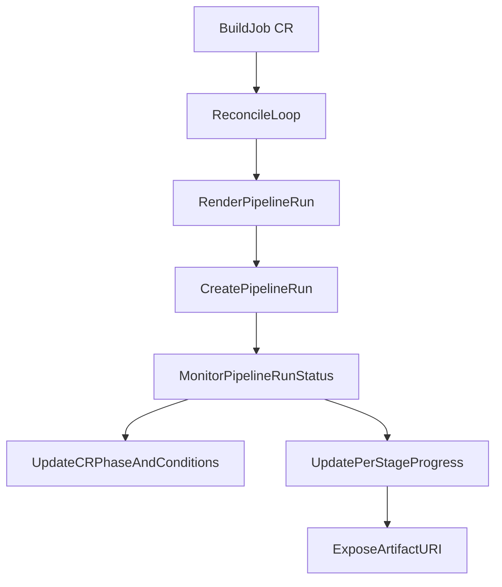

# Architecture

## Intent

Provide one operator and one CRD (`BuildJob`) that keeps the customization surface simple while preserving platform guardrails.

## API naming history

| Period | CRD name | Notes |
|--------|----------|-------|
| Early prototype | `AutomotiveBuild` | Original automotive-focused design |
| v0.1 design phase | `SoftwareBuild` | Generalized beyond automotive |
| **Current (v1alpha1)** | **`BuildJob`** | Canonical name in code, CLI, and API |

All new documentation and tooling should use `BuildJob`. References to
`AutomotiveBuild` or `SoftwareBuild` are legacy and retained only for
historical context.

## Boundary model

### Customer-owned inputs

- Source definition (`git`, `pvc`)
- Runtime image and per-stage command/image overrides
- User-defined stage names and ordering
- Target specification (`board`, `platform`, `architecture`, `variant`)
- Artifact collection path
- Cache mounts
- Secret references (names only)

### Platform-owned behavior

- Reconciliation engine and Tekton object shape
- Allowed destination/image policy (enforced externally or in future admission checks)
- ServiceAccount, RBAC and security defaults
- Status/condition semantics

## Reconciliation flow

## Runtime data flow

1. User creates a `BuildJob`.
2. Controller renders a Tekton `PipelineRun` with stage params from the CR.
3. Tekton executes tasks.
4. Controller watches child `PipelineRun` status changes.
5. Controller updates:
   - `status.phase`
   - `status.conditions`
   - `status.stages`
   - `status.currentPipelineRun`
   - `status.artifactURI`

## Extensibility

- Add policy enforcement through admission webhook.
- Add retries/backoff controls in `BuildJobSpec`.
- Add richer status (durations, taskrun links, logs URL).
