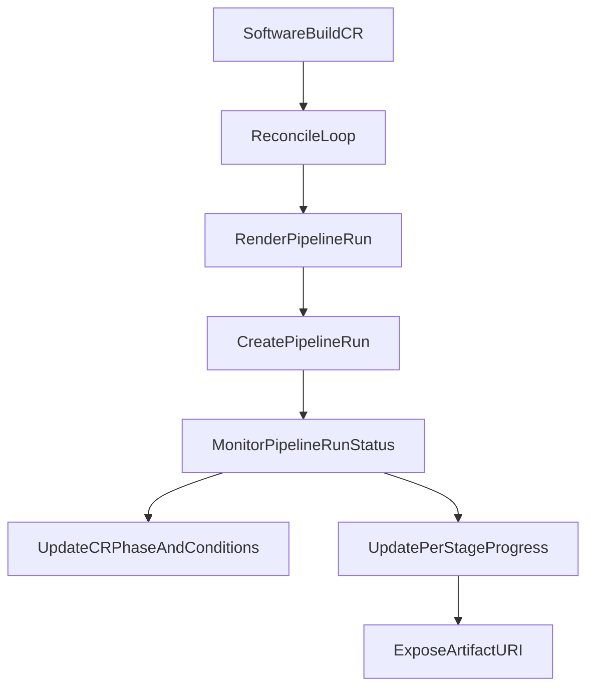

# Architecture

## Intent

Provide one operator and one CRD (`SoftwareBuild`) that keeps the customization surface simple while preserving platform guardrails.

## Boundary model

### Customer-owned inputs

- Source definition (`git`, `pvc`, `hostPath`)
- Runtime image and per-stage command/image overrides
- Stage commands for:
  - fetch
  - prebuild
  - build
  - postbuild
  - deploy
- Destination selection (`sharedFolder`, `registry`, `artifactory`, `quay`)
- Secret references (names only)

### Platform-owned behavior

- Reconciliation engine and Tekton object shape
- Allowed destination/image policy (enforced externally or in future admission checks)
- ServiceAccount, RBAC and security defaults
- Status/condition semantics

## Reconciliation flow

## Runtime data flow

1. User creates `SoftwareBuild`.
2. Controller renders a Tekton `PipelineRun` with stage params from CR.
3. Tekton executes tasks.
4. Controller polls/observes `PipelineRun` status.
5. Controller updates:
   - `status.phase`
   - `status.conditions`
   - `status.stages`
   - `status.currentPipelineRun`
   - `status.artifactURI`

## Extensibility

- Add policy enforcement through admission webhook.
- Add retries/backoff controls in `SoftwareBuildSpec`.
- Add richer status (durations, taskrun links, logs URL).
