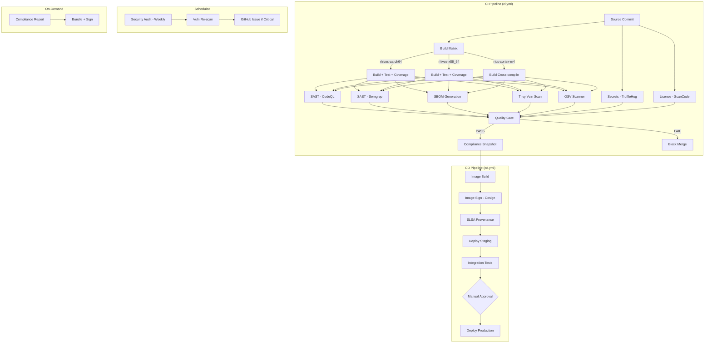

# Pipeline Architecture

## 1. Overview

This CI/CD pipeline builds, tests, secures, and deploys software for **RHIVOS (Red Hat In-Vehicle OS)** and **RTOS** edge devices. It generates compliance artifacts for **ISO 21434**, **ISO 26262**, **IEC 62443**, and **ASPICE**.

**Platforms**: RHIVOS AArch64, RHIVOS x86_64, RTOS Cortex-M4
**CI/CD**: GitHub Actions
**Deployment**: OSTree-based OTA (RHIVOS), firmware OTA (RTOS)

---

## 2. Architecture Diagram



---

## 3. Pipeline Stage Descriptions

| Job | Workflow | Purpose | Inputs | Outputs | Tools |
|---|---|---|---|---|---|
| build | ci.yml | Compile + unit test | Source code | Binaries, test results, coverage | GCC, Make, gcov |
| sast-codeql | ci.yml | Semantic code analysis | Source code | SARIF report | CodeQL |
| sast-semgrep | ci.yml | MISRA/CERT rule checking | Source code | SARIF report | Semgrep |
| sbom-generate | ci.yml | Software Bill of Materials | Source + deps | CycloneDX, SPDX JSON | Syft |
| vulnerability-scan | ci.yml | CVE detection | Source + deps | Trivy JSON, SARIF | Trivy |
| osv-scan | ci.yml | OSS vulnerability database | Lockfiles | OSV JSON | OSV-Scanner |
| secrets-scan | ci.yml | Credential leak detection | Full repo + history | JSON report | TruffleHog |
| license-scan | ci.yml | License compliance | Source tree | License JSON | ScanCode |
| quality-gate | ci.yml | Pass/fail decision | All scan results | Gate result | jq + custom logic |
| compliance-snapshot | ci.yml | Archive evidence | All artifacts | Compliance bundle | zip |
| image-build | cd.yml | Production image | Source code | Container image / firmware | Docker, Make |
| image-sign | cd.yml | Cryptographic signing | Image/binary | Signatures | Cosign |
| provenance | cd.yml | Build attestation | Image digest | SLSA attestation | GitHub Attestations |
| deploy-staging | cd.yml | Staging deployment | Signed image | OSTree commit / firmware | ostree, scp |
| integration-tests | cd.yml | System-level testing | Staged deployment | Test results | Custom |
| deploy-production | cd.yml | Production release | Approved staging | Deployment record | ostree |

---

## 4. Matrix Strategy

All three platforms are built in one workflow using GitHub Actions matrix:

```yaml
strategy:
  matrix:
    platform: [rhivos-aarch64, rhivos-x86_64, rtos-cortex-m4]
```

Platform-specific behavior is handled via `include` blocks and `if` conditions. SAST, SBOM, and security scans run once (platform-independent).

---

## 5. Quality Gates

### Blocking (Pipeline Fails)

| Check | Tool | Standard Reference |
|---|---|---|
| CRITICAL/HIGH vulnerabilities | Trivy | ISO 21434 Clause 8 |
| MISRA mandatory violations | Semgrep | ISO 26262 Part 6, Table 1 |
| CodeQL error-severity findings | CodeQL | ISO 21434 Clause 10 |
| Detected secrets | TruffleHog | IEC 62443 FR4 |
| Unit test failures | Make test | ASPICE SWE.4 |
| SBOM generation failure | Syft | ISO 21434 supply chain |
| Coverage below ASIL threshold | gcov | ISO 26262 Part 6, Table 12 |

### Advisory (Creates GitHub Issue)

| Check | Tool | Standard Reference |
|---|---|---|
| MEDIUM/LOW vulnerabilities | Trivy | ISO 21434 Clause 8 |
| CodeQL warnings | CodeQL | Best practice |
| Advisory rule violations | Semgrep | MISRA advisory |
| License incompatibility | ScanCode | Supply chain |

---

## 6. Security Architecture

### Signing Chain

```
Source Code (Git signed commits)
    |
    v
Container Image (Cosign keyless - Sigstore/Fulcio)
    |
    v
SLSA Provenance (GitHub Attestations - Level 3)
    |
    v
OSTree Commit (GPG signed)
    |
    v
Secure Boot (UEFI: PK -> KEK -> db -> shim -> kernel)
    |
    v
Application Integrity (dm-verity / IMA-appraisal)
```

### Trust Boundaries

| Boundary | Controls |
|---|---|
| Developer -> CI | GitHub OIDC, branch protection, signed commits |
| CI -> CD | Workflow run dependency, quality gate pass required |
| CD -> Registry | Cosign signing, SLSA provenance |
| Registry -> Device | GPG verification, secure boot, signature check |
| Device -> Vehicle Network | Firewall, SELinux, CAN authentication |

---

## 7. Compliance Integration

| Standard | Clause | Pipeline Stage | Evidence Generated |
|---|---|---|---|
| ISO 21434 | Clause 10 (Development) | ci.yml: sast-*, sbom | SARIF reports, SBOMs |
| ISO 21434 | Clause 8 (Monitoring) | security-audit.yml | Weekly audit reports |
| ISO 21434 | Clause 12 (Production) | cd.yml: sign, provenance | Signatures, attestations |
| ISO 26262 | Part 6 (SW Development) | ci.yml: build, test | Test results, coverage |
| ISO 26262 | Part 6, Table 1 | ci.yml: sast-semgrep | MISRA compliance reports |
| ISO 26262 | Part 8 (Tools) | All workflows | Tool versions pinned |
| IEC 62443 | FR3 (System Integrity) | cd.yml: sign | Cosign signatures |
| IEC 62443 | FR7 (Availability) | cd.yml: deploy | A/B rollback capability |
| ASPICE | SWE.4 (Unit Verification) | ci.yml: build (test) | Unit test results |
| ASPICE | SUP.8 (Config Mgmt) | All workflows | Git history, artifacts |

---

## 8. Operational Procedures

| Task | Command |
|---|---|
| Trigger compliance report | `gh workflow run compliance-report.yml -f release_version=v1.0.0 -f security_level=SL2 -f target_asil=ASIL-B` |
| Trigger manual security audit | `gh workflow run security-audit.yml` |
| Deploy to staging | `gh workflow run cd.yml -f environment=staging -f platform=rhivos-aarch64` |
| View quality gate results | Check PR comments or Actions summary tab |
| Download compliance bundle | Actions -> compliance-bundle artifact |

---

## References

- [Deployment Guide](deployment-guide.md)
- [CI Workflow](../.github/workflows/ci.yml)
- [CD Workflow](../.github/workflows/cd.yml)
- [Cosign Policy](../security/cosign-policy.yml)
